<h1>Programming Quiz With Admin Panel App 📱</h1>
<h3>Admin Panel</h3>
<h4>⁃ Display all questions in the database</h4>
<h4>⁃ Add new question to the database</h4>
<h4>⁃ Update question in the database</h4>
<h4>⁃ Delete question from the database</h4>
<h3>User Side</h3>
<h4>⁃ User can identify preferred name</h4>
<h4>⁃ There are 8 question per quiz</h4>
<h4>⁃ Questions are randomly generated</h4>
<h4>⁃ Users can takes as many quizzes as they want</h4>
<h1>Scren Shots 📷</h1>

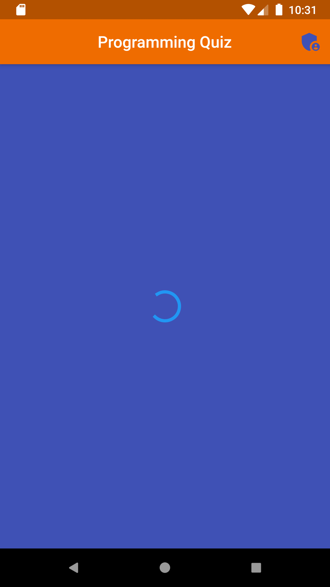
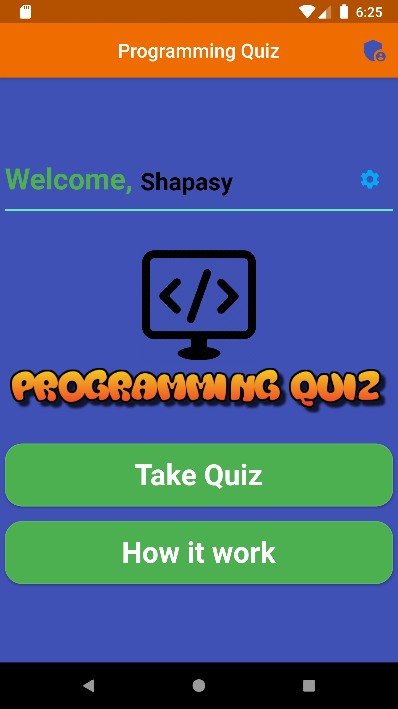
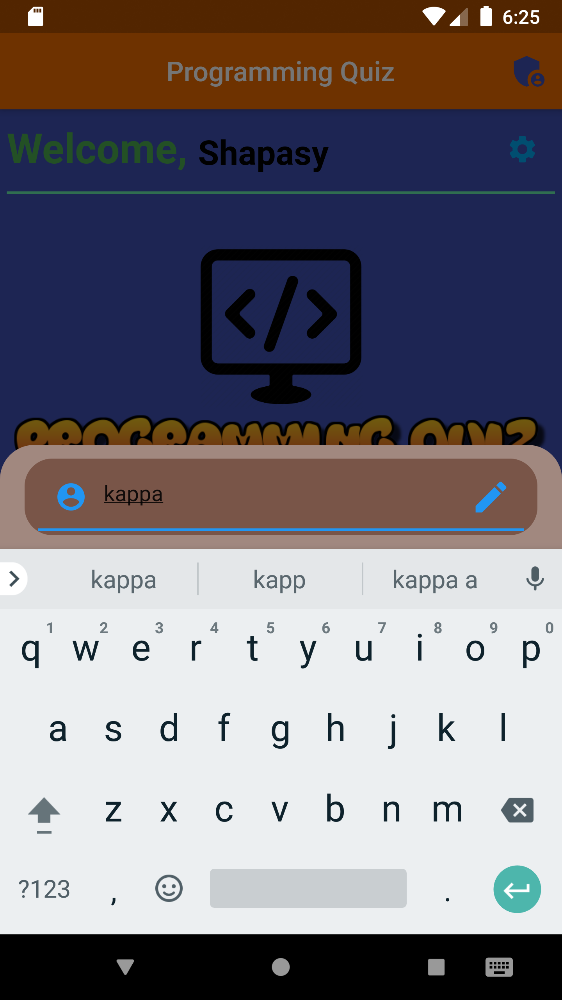
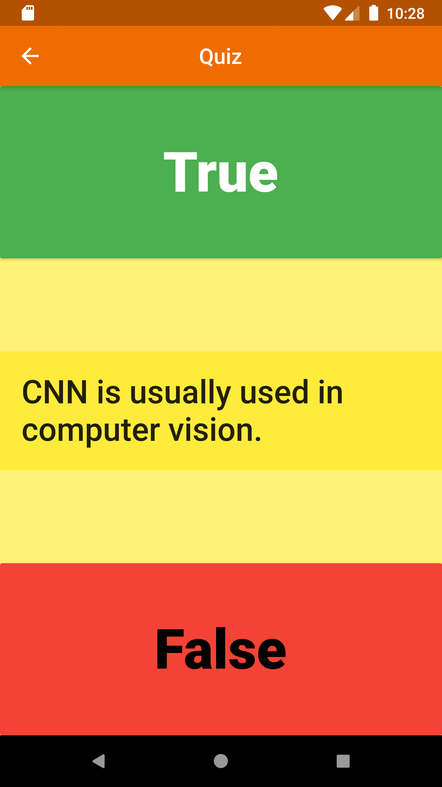

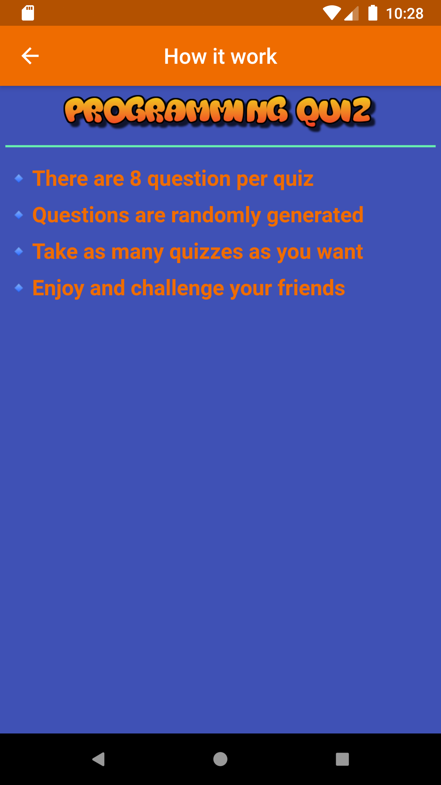
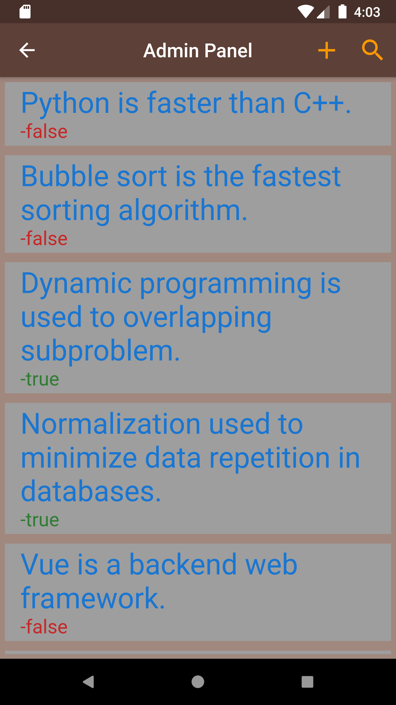
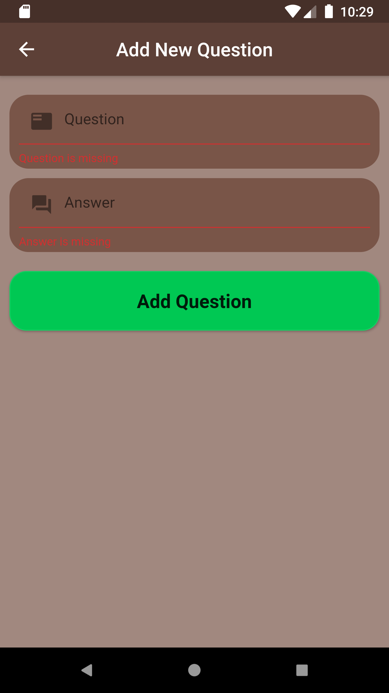

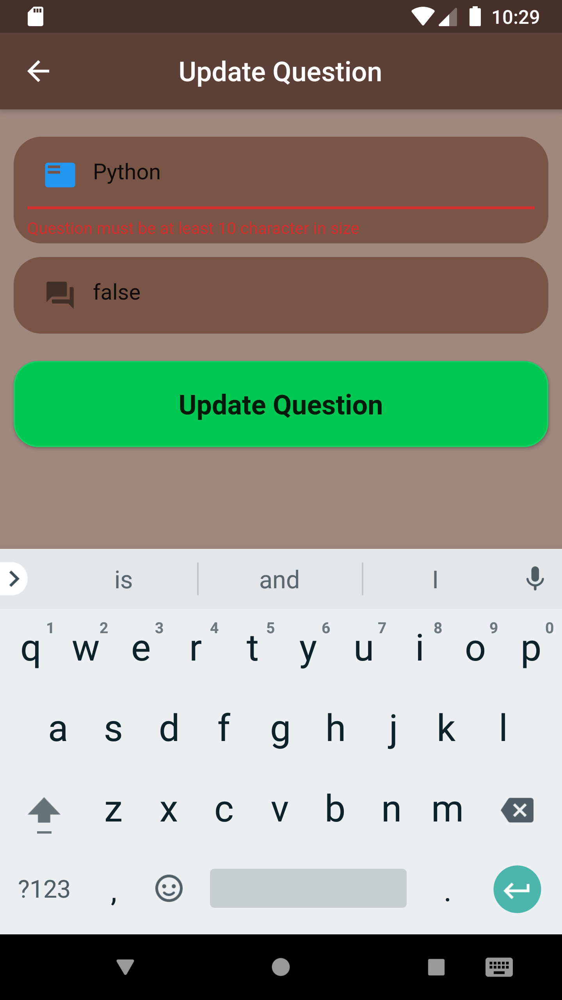
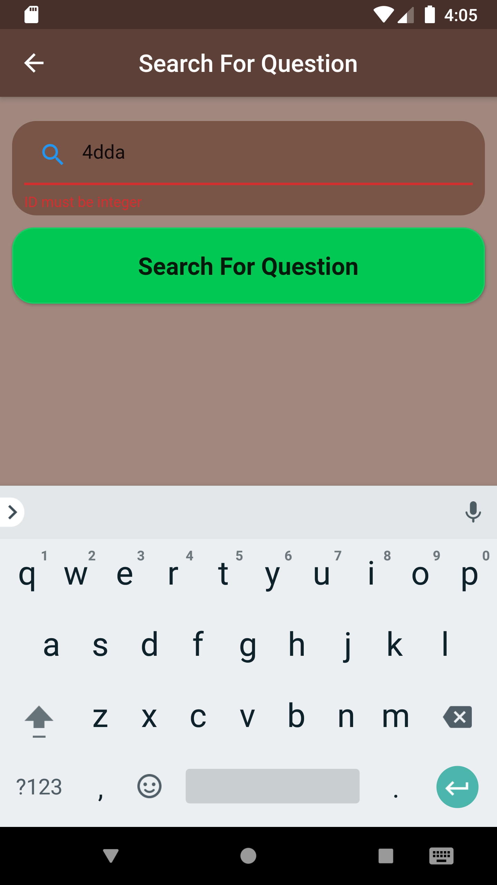

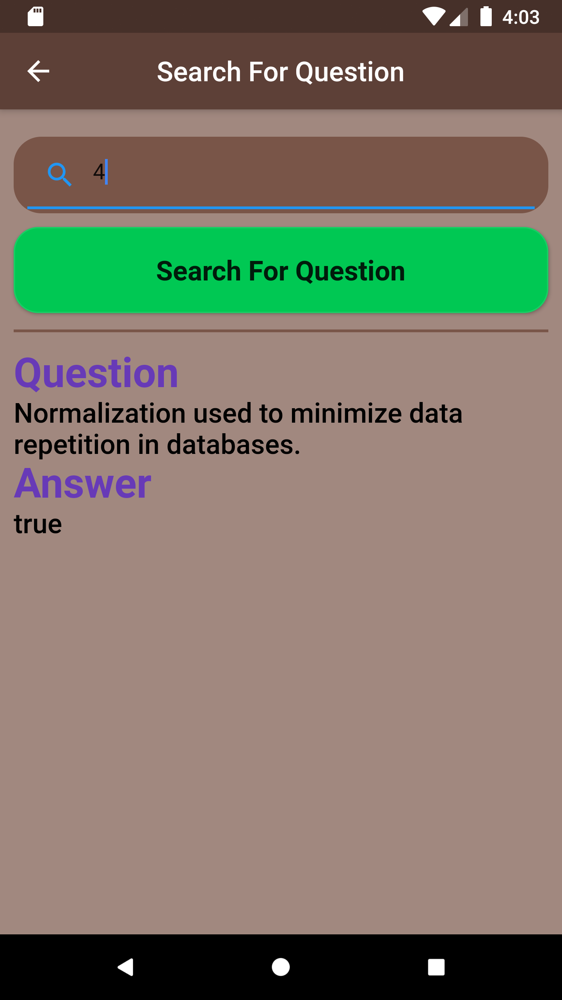
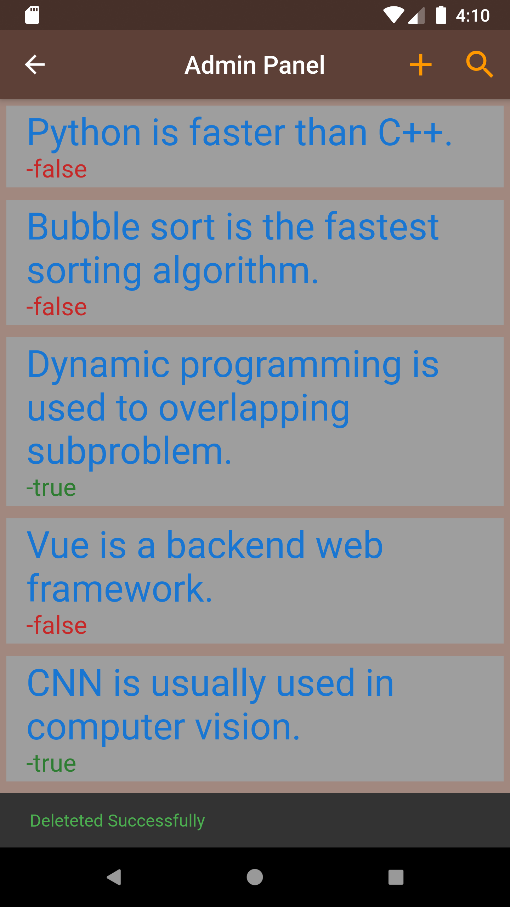

